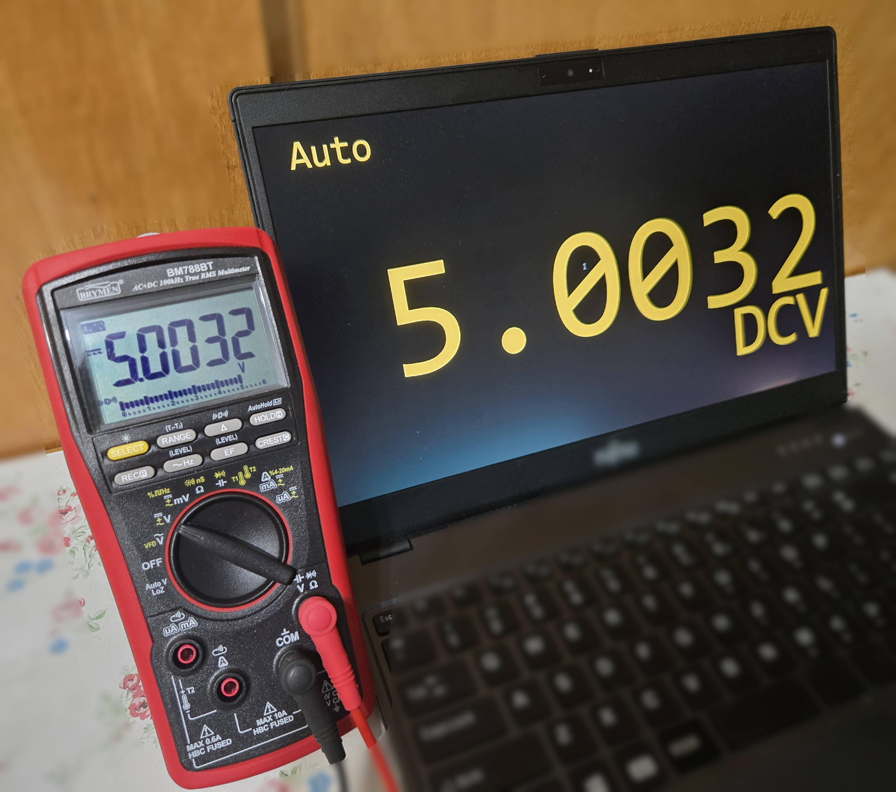

# brymenble-overlay Web Overlay

> **⚠️ Unofficial.** This is an independent, community-developed project. It is
> **not affiliated with, endorsed by, or sponsored by** Brymen Technology Corporation. "Brymen" and the device model names are trademarks of their
> respective owners.



Emulates the BM78xBT multimeter LCD as a overlay for OBS (or any
browser), driven live by the `brymenble` SDK over BLE.

## Setup

```bash
python -m venv .venv
.venv\Scripts\python -m pip install -r requirements.txt
```

`requirements.txt` installs the `brymenble` SDK from PyPI (which pulls in its
`bleak` dependency).

## Run

Explicit — MAC, custom password and port:

```bash
.venv\Scripts\python main.py 12:34:56:78:9A:BC --password 4321 --port 8765
```

Without a MAC, the first BM78xBT found by scanning is used (defaults:
password `0000`, port `8765`):

```bash
.venv\Scripts\python main.py
```

## Tests

Offline unit tests:

```bash
.venv\Scripts\python -m pip install -r requirements-dev.txt
.venv\Scripts\python -m pytest
```

These cover the render-state builder (`overlay/state.py`), the HTTP server
(`overlay/server.py`, including the path-traversal guard), and skin
validation via `tools/check_skin.py` (also run in CI).

## Skins

Each skin lives under `web/skins/` in its own folder:

- `skin.json` — static config: element-id maps plus `"script"` (the render
  module filename, default `"skin.js"`)
- `skin.js` — the skin's **render logic** (how it paints its own SVG)
- `meter.svg` — the display graphic, split into named elements
- `skin.css` — colors and effects

`web/overlay.js` is a thin host: it loads `skin.json`, injects `meter.svg`,
loads `skin.js`, polls `/state.json`, and calls the skin's `render(state, ctx)`.

### Render state (`/state.json`)

Semantic, skin-agnostic data built by `overlay/state.py`:
`value_digits` (per-digit `char`, `segments`, `dp`), `sign`, `unit`, `prefix`,
`function`, `icons`, `battery_low`, `rtc`. Each skin decides how to paint it.
The demo's "ALL (light everything)" item serves `state.mode: "all"` — a
self-test in which each skin turns on every element it owns (all segments/DPs,
units, prefixes, icons and annunciators).

### Skin module contract

A skin module registers on `window.__bm_skins`:

```js
window.__bm_skins = window.__bm_skins || {};
window.__bm_skins.default = {
  name: 'default',
  render(state, ctx) { /* paint this skin's SVG */ },
};
```

`ctx` provides small shared paint helpers bound to the skin's config:

- `ctx.skin` — parsed `skin.json`
- `ctx.byId(id)` / `ctx.show(id, on)` — element lookup / visibility
- `ctx.lightDigits(cells, offset)` — light `digit<k>_<seg>` from `value_digits`
  (offset 0 = left-aligned, `digits - cells.length` = right-aligned)
- `ctx.lightSign(on)`, `ctx.lightUnits(unit)`, `ctx.lightPrefixes(unit, prefix)`,
  `ctx.lightIcons(icons)`, `ctx.lightBattery(low)` — annunciator helpers

`skin.json` maps semantic keys to element ids (`digit_prefix`, `sign`, `unit`,
`prefix`, `icons`, `battery_low`, `hidden`, `function`, `rtc_label`).

- **`prefix`** is unit-aware: `{ unit: { symbol: id } }`, so a skin can use
  different glyphs for the same symbol on different units (e.g. a special
  milli used only for voltage).
- **`function`** is a skin decision — handled in `skin.js`, typically either:
  - `{ "type": "text", "id": "fn_text" }` — write the function name into a
    text element (used by `default`).
  - `{ "type": "icons", "map": { "DCV": "icon_dc", "DC+ACV": ["icon_dc", "icon_ac"], … } }`
    — light icon(s) for the active function (used by `official`).
- **`function_labels`** (optional) — per-skin display overrides for the SDK's
  canonical function names (used with `function.type: "text"`), e.g.
  `{ "Duty Cycle (%)": "DUTY", "nS Conductance": "nS" }`. Functions not
  listed fall back to the canonical name, so the SDK stays protocol-faithful.

Select a skin with `?skin=NAME` in the Browser Source URL.

## License

MIT — see [LICENSE](LICENSE).

"Brymen" and the device model names are trademarks of their respective owners;
this project is not affiliated with or endorsed by Brymen Technology Corporation.